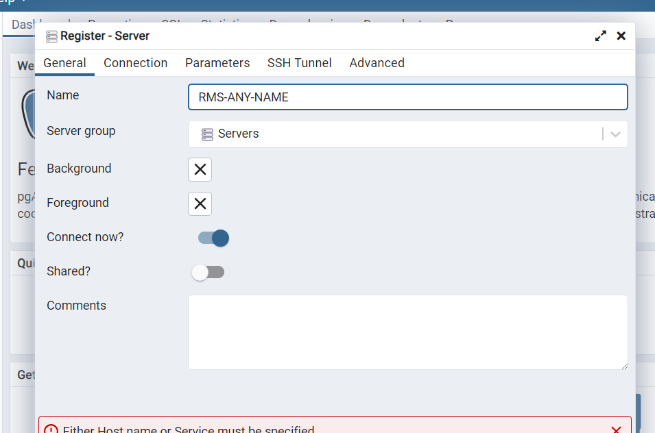
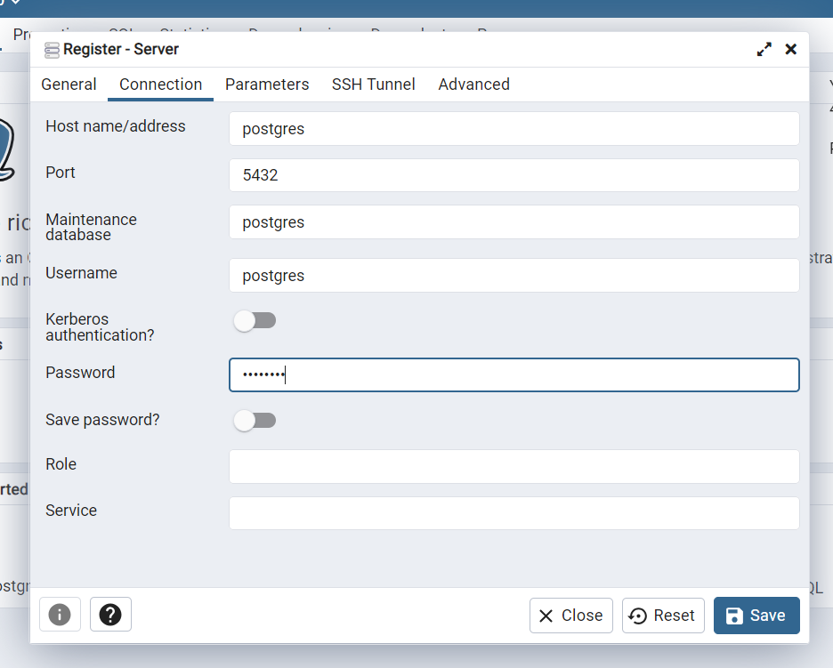
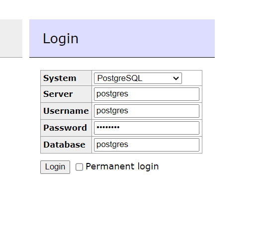

Set up of Docker with Postgress, PgAdmin and Adminer with Python CRUD.

Based on https://www.youtube.com/watch?v=eKEzq59FhEw and others.

Combines PgAdmin and Adminer for DB viewing.

YT: to follow

NOTE

conn = psycopg2.connect(
    database="postgres",
    user="postgres",
    password="postgres",
    host="host.docker.internal", !!! localhost etc don't seem to work...
)

## PG-ADMIN

<!--  -->
http://localhost:5050/
admin@email.com
admin

register-server

page-1 use any name
page-2:
      - POSTGRES_DB=postgres # optional
      - POSTGRES_USER=postgres
      - POSTGRES_PASSWORD=postgres

run docker-compose up in terminal ->

 ✔ Network postgres_default       Created                                                                                 
 ✔ Container postgres-pg-admin-1  Created                                                                                 
 ✔ Container postgres-postgres-1  Created                                                                                 
 ✔ Container postgres-adminer-1   Created     

https://www.youtube.com/watch?v=bu6IURMFZwQ

admininer login on port 8080

